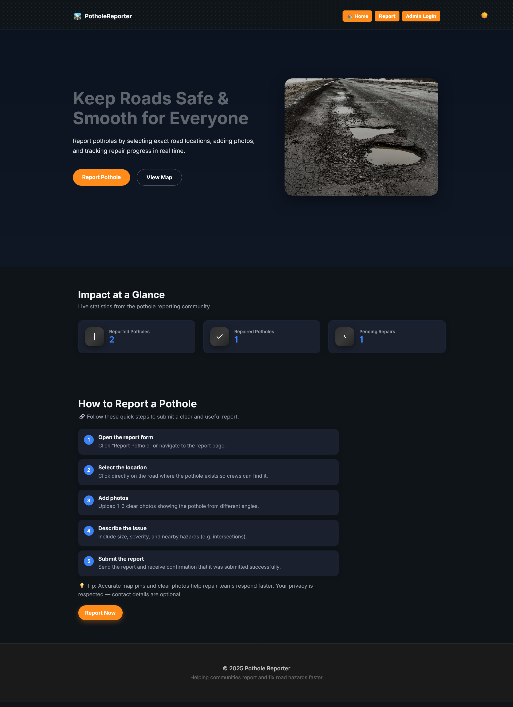
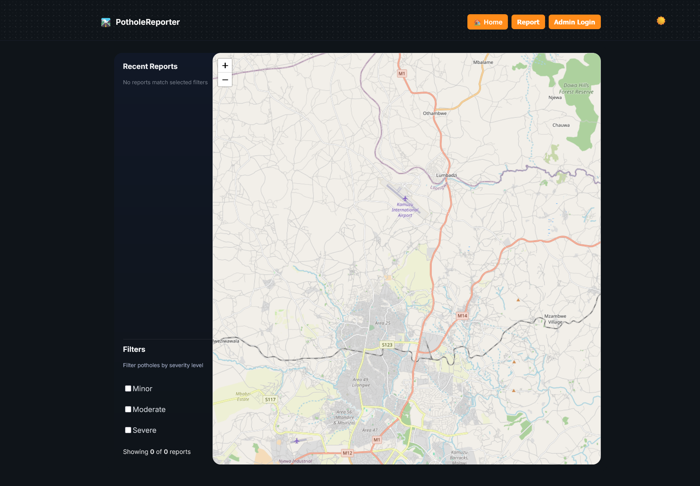
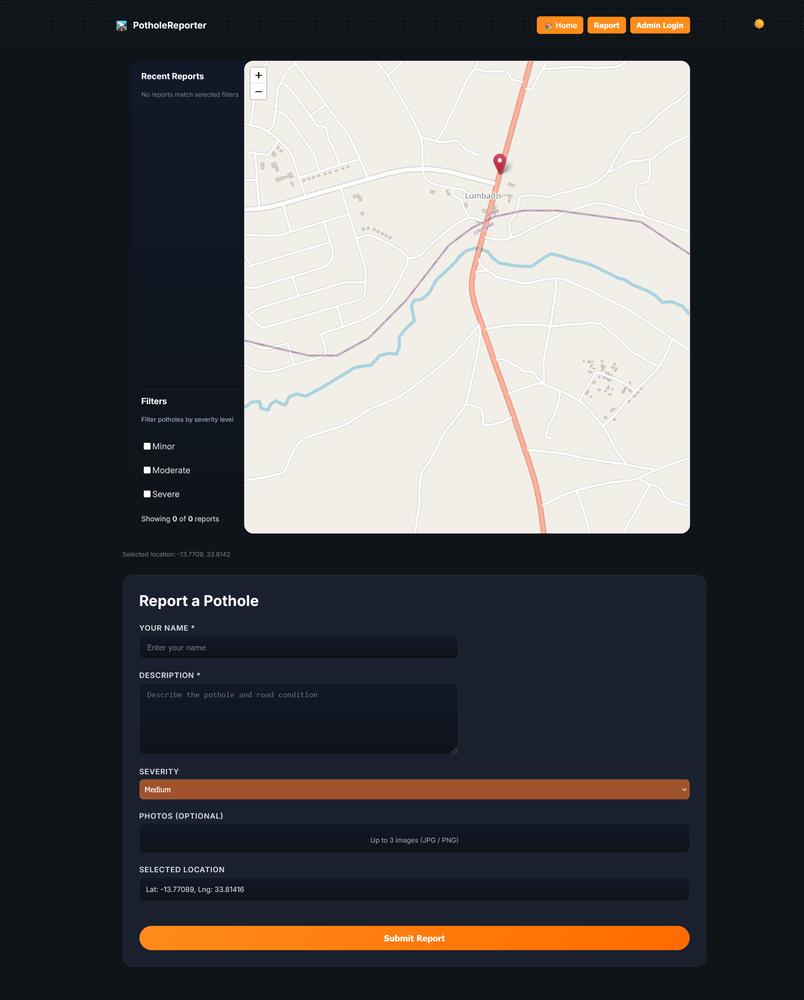
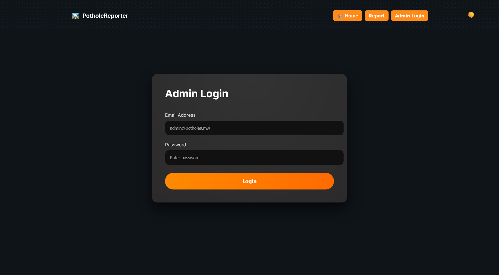
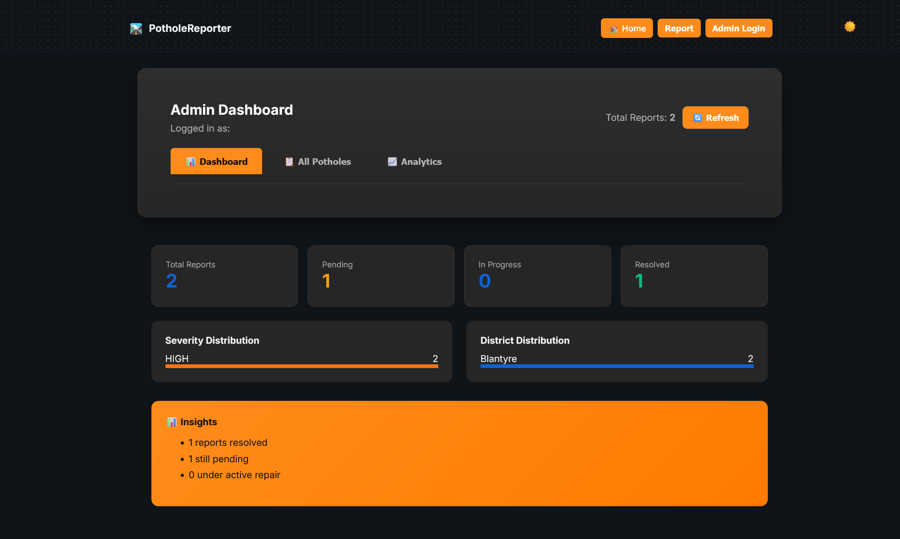
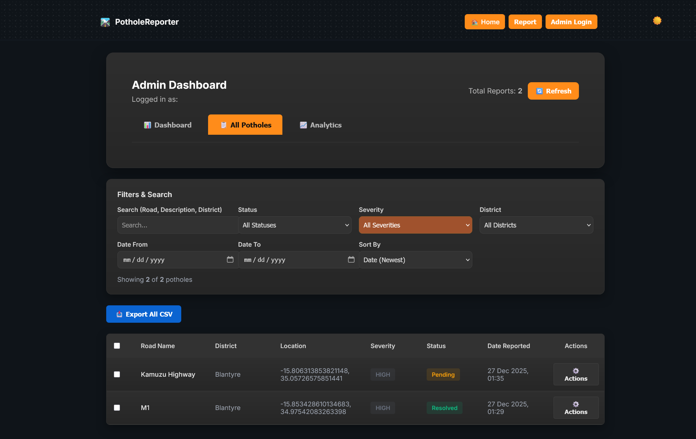
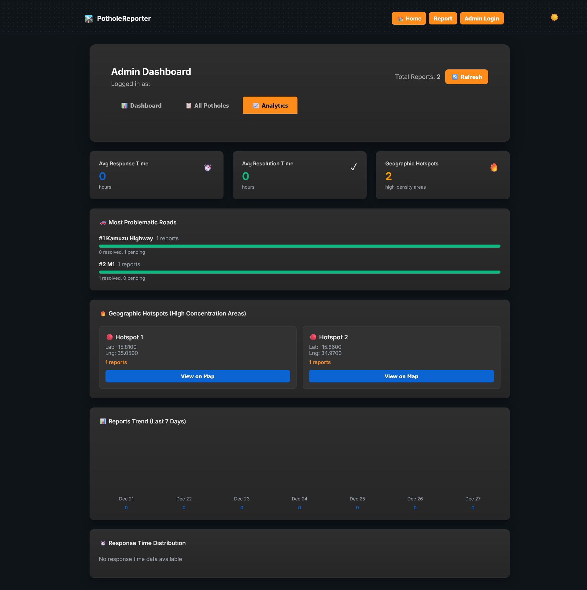
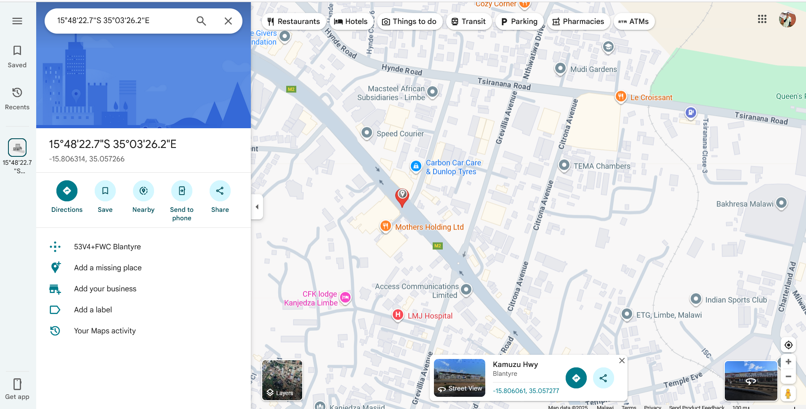
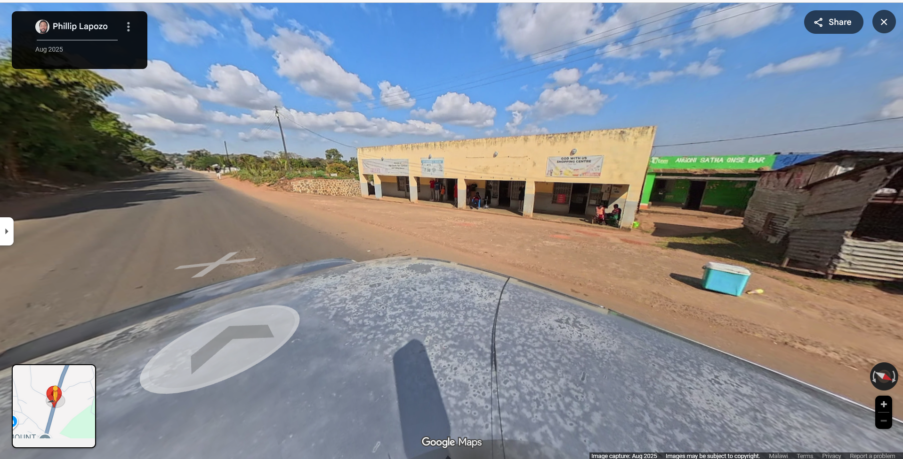

Perfect — here’s a **clean, professional, GitHub-ready README badge section + optimized header** you can **paste directly at the top of your README.md**.

I’ve designed this to:

* Look **professional & recruiter-friendly**
* Work with **GitHub badges**
* Match your **PotholeReporter** branding
* Increase **credibility + stars**

---

# ✅ **README HEADER + BADGES (COPY & PASTE)**

````md
# 🛣️ PotholeReporter  
**Smart Road Damage Reporting & Management Platform**


> 🚧 **A modern, map-driven web platform for reporting, tracking, and managing road infrastructure issues in real time.**

---

## 🌍 Live Demo  
🔗 **Coming Soon / Deployed URL Here**

---

## 📸 Preview

> Below are real screenshots from the application showcasing core features.











---

## 🚀 Features

✔ Report potholes with exact GPS location  
✔ Upload images for verification  
✔ Admin dashboard for monitoring & analytics  
✔ Interactive map (Leaflet)  
✔ Status tracking (Pending / In Progress / Resolved)  
✔ Responsive & mobile-friendly  
✔ Secure authentication  

---

## 🧠 System Overview

- **Frontend:** Next.js + Tailwind CSS  
- **Backend:** Node.js + Express  
- **Database:** PostgreSQL  
- **Maps:** Leaflet + OpenStreetMap  
- **Auth:** JWT-based authentication  

---

## 📊 Admin Dashboard Highlights

- Real-time analytics  
- Status & severity tracking  
- Map-based issue visualization  
- Role-based access control  

---

## 🧩 Folder Structure

```bash
frontend/
├── components/
├── pages/
├── context/
├── styles/
├── public/
└── utils/
````

---

## ⚙️ Setup Instructions

```bash
git clone https://github.com/YOUR_USERNAME/pothole-reporter.git
cd pothole-reporter
npm install
npm run dev
```

Create `.env.local`:

```env
NEXT_PUBLIC_API_URL=http://localhost:3005
```

---

## 🧠 Use Cases

* Local government road maintenance
* Smart city infrastructure monitoring
* Community-driven issue reporting
* Civil engineering analytics

---

## 🧑‍💻 Author

**Your Name**
🔗 LinkedIn: [https://linkedin.com/in/lusungu](https://linkedin.com/in/lusungu)
💼 GitHub: [https://github.com/lusungu-skillset](https://github.com/lusungu-skillset)

# Pothole-Reporter-Frontend
